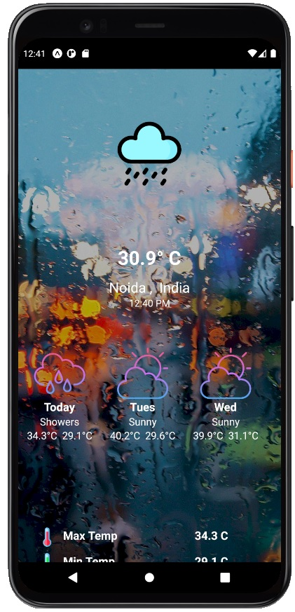
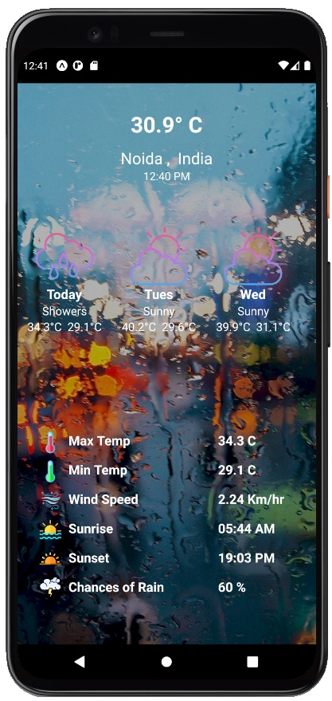
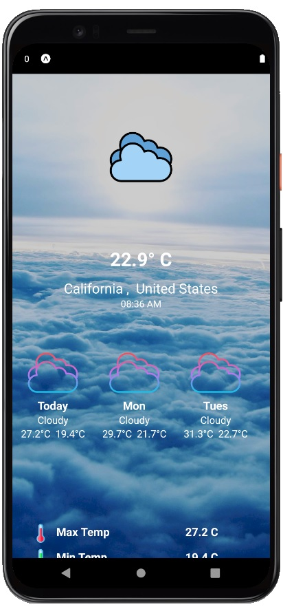
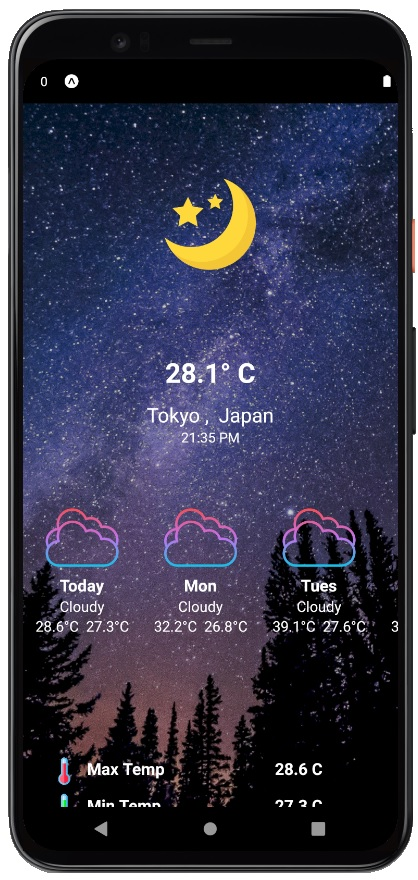

# Weather-App
### Weather forecasting is the prediction of what the atmosphere will be like in a particular  
### place by using technology and scientific knowledge to make weather observations 
### This is a Weather App made using React Native and can find the weather data for most of the cities in the world . 

App Screens
-------
| Home Screen   |
| ------------- |
|      |

| 5 days Forcast      | Todays Weather      | 
| ------------- | -----:|
|       |  |

| Cloudy   |
| ------------- |
|- If the cloud cover is more than 30% there is more likely to be cloudy|
|      |

| Night   |
| ------------- |
|      |

## Features
#### You can either find the weather of your current location by turning location ON  
#### or you can find the weather of any city in the world.
